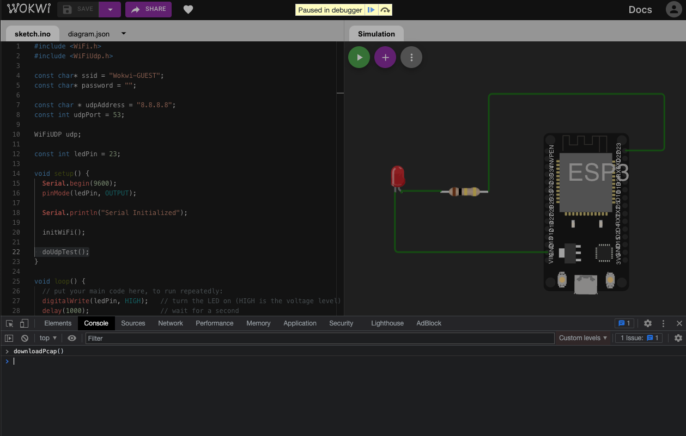

# ESP32 Packet Captures

This week I discovered [WOKWI](https://wokwi.com/) for simulating Arduino and ESP32. [WOKWI YouTube](https://www.youtube.com/c/Wokwi) Channel



* [WOKWI Test Sketch](https://wokwi.com/arduino/projects/319698935281091154)
* [WOKWI Documentation](https://docs.wokwi.com/parts/wokwi-servo)

## Blink

Create new circuit with the following. When the sketch is run WOKWI will show the LED flash on and off. Since we use `Serial.print()` WOKWI will will also show the console output.

**Use:**

* ESP32
* 1K Ω Resistor (`D23`->`LED`)
* LED (`R1`, `GND`)


Use the following code:

```
const int ledPin = 23;

void setup() {
  Serial.begin(9600);
  pinMode(ledPin, OUTPUT);
  Serial.println("Serial Initialized");
}

void loop() {
  digitalWrite(ledPin, HIGH);   // turn the LED on (HIGH is the voltage level)
  delay(10--00);                  // wait for a second
  digitalWrite(ledPin, LOW);    // turn the LED off by making the voltage LOW
  delay(1000);                  // wait for a second
}

```

## Example Connect to WiFi

```
#include <WiFi.h>

const char* ssid = "Wokwi-GUEST";
const char* password = "";

const int ledPin = 23;

void setup() {
  Serial.begin(9600);
  pinMode(ledPin, OUTPUT);

  Serial.println("Serial Initialized");
  
  initWiFi();
}

void loop() {
  // put your main code here, to run repeatedly:
  digitalWrite(ledPin, HIGH);   // turn the LED on (HIGH is the voltage level)
  delay(10--00);                  // wait for a second
  digitalWrite(ledPin, LOW);    // turn the LED off by making the voltage LOW
  delay(1000);                  // wait for a second
}

void initWiFi() {
  WiFi.mode(WIFI_STA);
  WiFi.begin(ssid);
  Serial.print("Connecting to WiFi ..");
  while (WiFi.status() != WL_CONNECTED) {
    Serial.print('.');
    delay(1000);
  }

  Serial.print("\n\t");
  Serial.println(WiFi.localIP());
}


```

**Output**

```
Serial Initialized
Connecting to WiFi .....
	10.5.75.153
```

## DNS Request

```
#include <WiFi.h>
#include <WiFiUdp.h>

const char* ssid = "Wokwi-GUEST";
const char* password = "";

const char * udpAddress = "8.8.8.8";
const int udpPort = 53;

WiFiUDP udp;


const int ledPin = 23;

void setup() {
  Serial.begin(9600);
  pinMode(ledPin, OUTPUT);

  Serial.println("Serial Initialized");

  initWiFi();
  doUdpTest();
}

void loop() {
  // put your main code here, to run repeatedly:
  digitalWrite(ledPin, HIGH);   // turn the LED on (HIGH is the voltage level)
  delay(100);                  // wait for a second
  digitalWrite(ledPin, LOW);    // turn the LED off by making the voltage LOW
  delay(1000);                  // wait for a second

}

void doUdpTest() {

  // Hard coded simple DNS query (28 bytes)
  // See DNSClient.java to see how payload was generated
  uint8_t buffer[50] = {
      0x12, 0x34, 0x1, 0x0, 0x0, 0x1, 0x0, 0x0, 0x0, 0x0,
      0x0, 0x0, 0x6, 0x67, 0x6f, 0x6f, 0x67, 0x6c, 0x65, 0x3,
      0x63, 0x6f, 0x6d, 0x0, 0x0, 0x1, 0x0, 0x1 
  };

  Serial.println("Sending DNS Request...");
  //This initializes udp and transfer buffer
  udp.beginPacket(udpAddress, udpPort);
  udp.write(buffer, 28);
  udp.endPacket();
  memset(buffer, 0, 50);

  //processing incoming packet, must be called before reading the buffer
  Serial.println("udp.parsePacket()");
  udp.parsePacket();
  
  //receive response from server, it will be HELLO WORLD
  while (1) {
    int count = udp.read(buffer, 50);
    if(count > 0) {
      Serial.println("Response: \n\t");
      for (int i = 0; i < count; i++) {
        Serial.print(" 0x");
        Serial.print(buffer[i], HEX);
      }
      Serial.print("\n");
      break;
    }
    delay(100);
  }

  Serial.printf("udp done.\n");
  delay(1000);
}


void initWiFi() {
  WiFi.mode(WIFI_STA);
  WiFi.begin(ssid);
  Serial.print("Connecting to WiFi ..");
  while (WiFi.status() != WL_CONNECTED) {
    Serial.print('.');
    delay(1000);
  }

  Serial.print("\n\t");
  Serial.println(WiFi.localIP());
}
```


## Worlds Worst DNS Client

* [DNSClient.java](dnsclient/DNSClient.java)

```
google.com has 2 parts
Writing: google
Writing: com
Sending: 28 bytes
0x12 0x34 0x1 0x0 0x0 0x1 0x0 0x0 0x0 0x0 0x0 0x0 0x6 0x67 0x6f 0x6f 0x67 0x6c 0x65 0x3 0x63 0x6f 0x6d 0x0 0x0 0x1 0x0 0x1 

Received: 44 bytes
 0x12  0x34  0x81  0x80  0x0  0x1  0x0  0x1  0x0  0x0  0x0  0x0  0x6  0x67  0x6f  0x6f  0x67  0x6c  0x65  0x3  0x63  0x6f  0x6d  0x0  0x0  0x1  0x0  0x1  0xc0  0xc  0x0  0x1  0x0  0x1  0x0  0x0  0x0  0x23  0x0  0x4  0x8e  0xfa  0xbf  0xce 

Transaction ID: 0x1234
Flags: 0x8180
Questions: 0x1
Answers RRs: 0x1
Authority RRs: 0x0
Additional RRs: 0x0
Record: google
Record: com
Record Type: 0x1
Class: 0x1
Field: 0xc00c
Type: 0x1
Class: 0x1
TTL: 0x23
Len: 0x4
Address: 142.250.191.206.
```


## Logic Analyzer

WOKWI has a [logic analyzer](https://docs.wokwi.com/guides/logic-analyzer)

